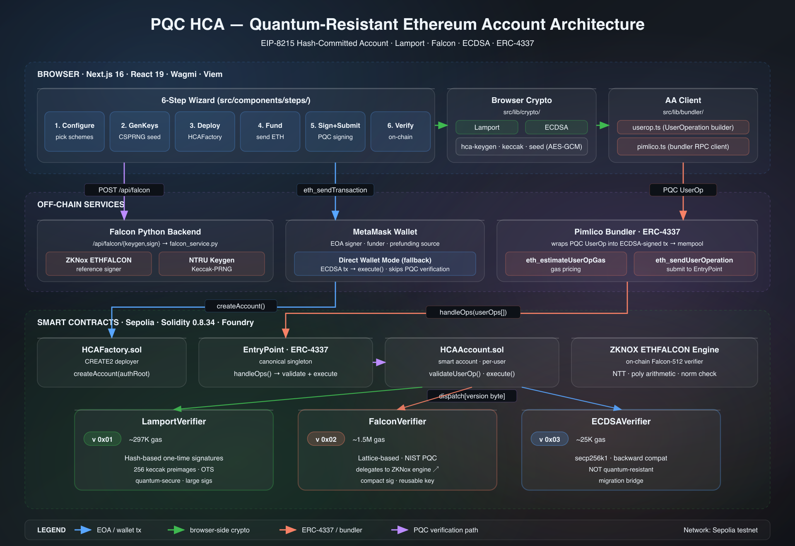

# PQC ETH PoC

Interactive wizard for creating and using quantum-resistant Ethereum accounts. Supports both the [Hash-Committed Account (HCA)](https://ethereum-magicians.org/t/eip-8215-hash-committed-account-hca/28094) flow and the PQC-4337 scheme-specific account flow.

## What It Does

The app has two 6-step flows on Sepolia:

1. **HCA flow**
   configure mixed leaves (Lamport/Falcon/ECDSA), generate Merkle root, deploy `HCAAccount`, fund, sign UserOperation, verify.
2. **PQC-4337 flow**
   select one scheme (`falcon-eth` or `mldsa-eth`), generate keypair in browser, register key + deploy scheme-specific account, fund, sign UserOperation, verify.

Both flows use ERC-4337 submission (Pimlico) for on-chain PQC verification.

## Quick Start

```bash
git clone --recurse-submodules https://github.com/LimeChain/pqc-eth-poc.git
cd pqc-eth-poc
npm install

cp .env.example .env.local
# Set only deploy credentials in .env.local:
# PRIVATE_KEY=0x...
# SEPOLIA_RPC_URL=https://...
#
# Then deploy; script auto-writes all NEXT_PUBLIC_* addresses to .env.local
./scripts/deploy.sh

# Optional: needed only for HCA Falcon leaves (not needed for PQC-4337 flow)
./scripts/setup-falcon.sh

npm run dev
# Open http://localhost:3000
```

> **Why Python in this repo?** This is required only for **HCA Falcon leaves** (`/api/falcon/{keygen,sign}` against the ZKNox reference signer).  
> The **PQC-4337 flow** signs in browser with `@noble/post-quantum`.

## Environment Variables

If you use `./scripts/deploy.sh`, you only need to set `PRIVATE_KEY` and `SEPOLIA_RPC_URL` manually. The script auto-wires frontend `NEXT_PUBLIC_*` contract addresses in `.env.local`.

| Variable | Required | Description |
|----------|----------|-------------|
| `PRIVATE_KEY` | Yes for deploys | Deployer private key used by `./scripts/deploy.sh` |
| `SEPOLIA_RPC_URL` | Yes for deploys | Sepolia RPC endpoint used by `./scripts/deploy.sh` |
| `NEXT_PUBLIC_ENTRYPOINT_V07` | Yes for PQC-4337 | EntryPoint v0.7 address used by PQC-4337 user-ops |
| `NEXT_PUBLIC_HCA_FACTORY` | Yes | HCAFactory contract address |
| `NEXT_PUBLIC_LAMPORT_VERIFIER` | Yes | LamportVerifier contract address |
| `NEXT_PUBLIC_ECDSA_VERIFIER` | Yes | ECDSAVerifier contract address |
| `NEXT_PUBLIC_FALCON_VERIFIER` | No | FalconVerifier address (set to `0x0...0` if not deployed) |
| `NEXT_PUBLIC_PQC4337_FACTORY` | Yes for PQC-4337 | Factory for scheme-specific PQC-4337 accounts |
| `NEXT_PUBLIC_FALCON_ETH_VERIFIER` | Yes for `falcon-eth` flow | ZKNOX ETHFALCON verifier used by PQC-4337 flow |
| `NEXT_PUBLIC_MLDSA_ETH_VERIFIER` | Yes for `mldsa-eth` flow | ZKNOX ETHDILITHIUM verifier used by PQC-4337 flow |
| `NEXT_PUBLIC_PIMLICO_API_KEY` | Recommended | ERC-4337 bundler key. Without it, app can fall back to direct wallet execution (no on-chain PQC `validateUserOp` path). Free tier at [dashboard.pimlico.io](https://dashboard.pimlico.io/) |
| `FALCON_ENGINE` | Optional for deploys | Existing ETHFALCON engine address. Leave unset to auto-deploy a fresh engine; set to `0x0...0` to skip Falcon support |

## Deploy Contracts

Requires [Foundry](https://getfoundry.sh/) and Sepolia ETH.

```bash
curl -L https://foundry.paradigm.xyz | bash && foundryup

cd contracts && forge install && cd ..

export PRIVATE_KEY=0xYOUR_KEY
export SEPOLIA_RPC_URL=https://sepolia.infura.io/v3/YOUR_KEY

./scripts/deploy.sh
```

By default, `./scripts/deploy.sh` deploys the full local stack in one run:

- a fresh ETHFALCON engine for the HCA Falcon wrapper unless `FALCON_ENGINE` is provided
- the HCA contracts (`LamportVerifier`, `ECDSAVerifier`, optional `FalconVerifier`, `HCAFactory`)
- the PQC-4337 contracts (`ZKNOX_ethfalcon`, `ZKNOX_ethdilithium`, `PqcAccountFactory`)
- automatic `.env.local` wiring for all HCA and PQC frontend addresses

If you already trust an engine deployment, set `FALCON_ENGINE=0x...` before running the script. If you want to skip Falcon entirely on the HCA path, set `FALCON_ENGINE=0x0000000000000000000000000000000000000000`.

Or manually:

```bash
cd contracts
forge script script/DeployHCA.s.sol \
  --rpc-url $SEPOLIA_RPC_URL \
  --broadcast \
  --sender $(cast wallet address --private-key $PRIVATE_KEY) \
  --private-key $PRIVATE_KEY
```

After deploying, `.env.local` is updated automatically. For a manual wiring flow, run:

```bash
./scripts/wire.sh <hca_factory> <lamport> <ecdsa> <falcon> <pqc_factory> <falcon_eth_verifier> <mldsa_eth_verifier> <entrypoint_v07> [falcon_engine]
```

Verify deployment: `./scripts/verify.sh`

## Architecture



The diagram above shows how the three layers connect:

- **Browser (Next.js)** — runs both flows, builds UserOperations, and signs either with HCA leaf logic or PQC-4337 scheme-specific keys.
- **Off-chain services** — Pimlico ERC-4337 bundler, MetaMask for funding/fallback direct calls, and optional Falcon Python backend for HCA Falcon leaves.
- **Smart contracts (Sepolia)** — `HCAFactory`/`HCAAccount` stack and `PqcAccountFactory` with scheme-specific accounts/verifiers.

Source: [`docs/diagrams/architecture.svg`](docs/diagrams/architecture.svg).

### Why a bundler?

Ethereum's protocol only validates ECDSA signatures. PQC signatures (Lamport/Falcon-ETH/ML-DSA-ETH) cannot enter mempool directly. [ERC-4337 Account Abstraction](https://eips.ethereum.org/EIPS/eip-4337) solves this by moving signature verification into smart contracts:

1. **You** build a UserOperation (a data blob, not a transaction) and sign it with your PQC key
2. **The bundler** (Pimlico) wraps your UserOperation in a regular ECDSA-signed transaction and submits it to the EntryPoint contract
3. **The EntryPoint** calls your account's `validateUserOp()`, which verifies the PQC signature on-chain
4. **If valid**, the EntryPoint calls `execute()` to perform the actual action (send ETH, call a contract, etc.)

The bundler is the bridge between PQC-signed intents and Ethereum's ECDSA-only mempool. Without it, there is no `validateUserOp` path for PQC verification. The app's direct wallet fallback calls `execute()` from MetaMask, which skips PQC verification.

[Pimlico](https://pimlico.io/) is the bundler service used here. Free tier works for testnet. Get an API key at [dashboard.pimlico.io](https://dashboard.pimlico.io/).

### HCA Flow

```text
Browser (Next.js)                    Sepolia
  |                                      |
  |-- 1. Generate seed (CSPRNG)          |
  |-- 2. Derive Lamport/Falcon/ECDSA leaves
  |-- 3. Compute authRoot (Merkle)       |
  |                                      |
  |-- 4. Deploy HCAAccount -----------> HCAFactory.createAccount(authRoot)
  |-- 5. Fund account ----------------> send ETH
  |                                      |
  |-- 6. Sign userOpHash (leaf key)      |
  |-- 7. Submit UserOp ------.           |
  |                           |          |
  |    Pimlico bundler <------'          |
  |                           |          |
  |                           '-------> EntryPoint.handleOps()
  |                                      |-> HCAAccount.validateUserOp()
  |                                      |     verify Merkle proof + verifier dispatch
  |                                      |-> HCAAccount.execute()
```

### PQC-4337 Flow (falcon-eth / mldsa-eth)

```text
Browser (Next.js)                         Sepolia
  |                                           |
  |-- 1. Generate keypair in browser          |
  |-- 2. Deploy via factory ----------------> PqcAccountFactory.create*WithKey()
  |                                           |-> verifier.setKey(encodedPublicKey)
  |                                           |-> deploy scheme-specific account
  |-- 3. Fund account ----------------------> send ETH
  |-- 4. Build + sign UserOp (browser)        |
  |-- 5. Submit UserOp ---------.             |
  |                            |              |
  |    Pimlico bundler <-------'              |
  |                            |              |
  |                            '-----------> EntryPoint v0.7.handleOps()
  |                                           |-> FalconEthAccount / MlDsaEthAccount.validateUserOp()
  |                                           |-> execute()
```

## Version Bytes

Each leaf in the Merkle tree has a version byte that selects the verification scheme:

| Version | Scheme | Verifier | Gas Cost |
|---------|--------|----------|----------|
| `0x01` | Lamport | LamportVerifier | ~297K |
| `0x02` | Falcon | FalconVerifier | ~1.5M |
| `0x03` | ECDSA | ECDSAVerifier | ~25K |

One account can have leaves of different schemes. Start with ECDSA for backward compatibility, add Lamport/Falcon leaves for quantum resistance, then stop using ECDSA leaves when ready.

## Security & Production Readiness

### What is real (no mocks)

Every layer of the Falcon integration uses real cryptographic implementations:

| Layer | Implementation |
|-------|---------------|
| `ZKNOX_ethfalcon.sol` | Full Falcon-512 on-chain verifier — real NTT transforms, polynomial arithmetic, and norm checking |
| `FalconVerifier.sol` | Thin wrapper that calls the ZKNOX engine's `verify()` |
| `falcon_service.py` | Wraps ZKNOX's Python reference implementation; real NTRU keygen and Keccak-based signing |
| `/api/falcon/{keygen,sign}` | Spawns `falcon_service.py` — no stub code paths |
| `SignSubmit.tsx` | Calls the API, validates `pkCompact` against stored keygen output, encodes for on-chain verification |
| Sepolia deployment | Live contracts: engine `0xBa2f...BD59`, verifier `0xc866...b0c3` |
| `check-falcon.sh` | Runs a known-good test vector against the live engine before and after each deploy |

Lamport and ECDSA leaves are fully browser-side (no backend dependency).

### Caveats before mainnet

**1. ZKNOX marks this library as experimental**

The `ZKNOX_ethfalcon` contract header and README both state:
> *"This is an experimental work, not audited: DO NOT USE IN PRODUCTION, LOSS OF FUND WILL OCCUR."*

The ETHFALCON variant replaces SHAKE with Keccak for gas efficiency. The security equivalence of this substitution has not been formally analysed. This implementation is suitable for Sepolia/testnet use and research. Mainnet deployments with real funds require a formal security review of the Keccak-PRNG variant.

**2. Python backend is not load-hardened**

Each `/api/falcon/sign` call spawns a fresh Python subprocess. There is no connection pooling, rate limiting, or timeout enforcement. Under sustained load this will exhaust server resources. Before any production deployment, replace the subprocess model with a persistent daemon (e.g. a long-running FastAPI service or a WASM port of the signer).

## License

MIT
